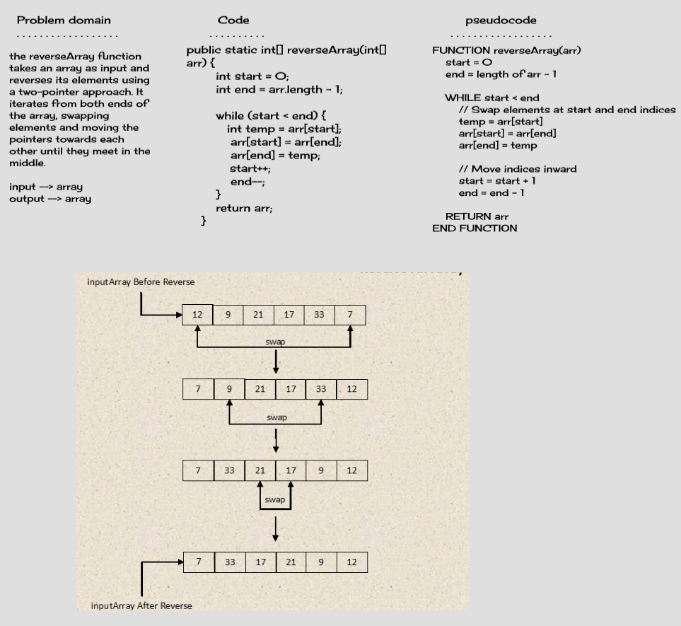
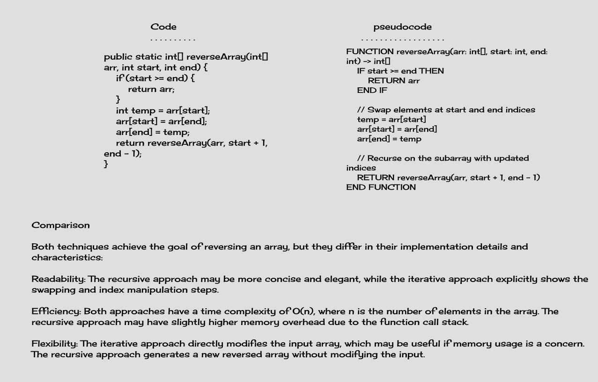

# Code Challenge 01 - array-reverse

The reverseArray() function reverses an array. The first array element becomes the last, and the last array element becomes the first and so on

## Whiteboard Process



## Approach & Efficiency

reverseArray function in Java uses a two-pointer approach to swap elements and reverse the array in-place. The time complexity of this approach is O(n/2), which simplifies to O(n), where n is the number of elements in the array

## Stretch Goal

### Technique 2: Recursive Approach



## Solution

### Running the Code

1. Copy the provided `reverseArray` function into a Java file and ensur that your class name `ArrayReverse`, e.g., `ArrayReverse.java`.

2. Compile the Java file using the following command:

        - javac ArrayReverse.java
        - java ArrayReverse

Suppose you have the following array --> int[] input = {1, 2, 3, 4, 5, 6};

int[] reversed = reverseArray(input);

Original Array : 1 2 3 4 5 6

Reversed Array : 6 5 4 3 2 1

## Structure and Testing

### `reverseArray` Function

The main focus of this challenge is the `reverseArray` function. It takes an array as an argument and returns a new array with elements in reversed order. The function follows a two-pointer approach to swap elements and achieve the reversal in an efficient manner.

### Unit Testing

To ensure the correctness of the `reverseArray` function, a suite of tests should be written. These tests will cover various scenarios

```java

public class ArrayReverseTest {

    @Test
    public void testReverseArrayHappyPath() {
        int[] input = {1, 2, 3, 4, 5, 6};
        int[] expected = {6, 5, 4, 3, 2, 1};
        int[] reversed = ArrayReverse.reverseArray(input);
        assertArrayEquals(expected, reversed);
    }

    @Test
    public void testReverseArrayEmptyArray() {
        int[] input = {};
        int[] expected = {};
        int[] reversed = ArrayReverse.reverseArray(input);
        assertArrayEquals(expected, reversed);
    }

}