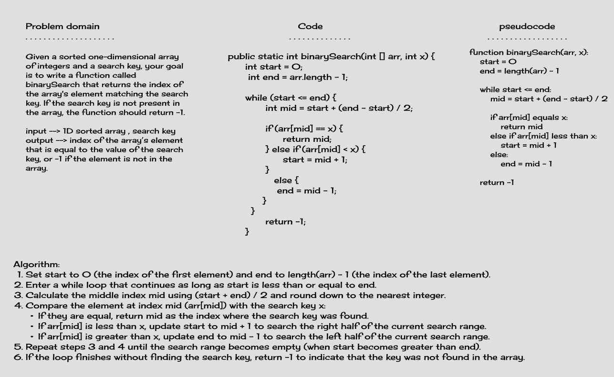

# Code Challenge 03 - array-binary-search

## Whiteboard Process



## virtualization

search about 13 in given array :


## Stretch Goal

If you're searching for a certain property value in an array of objects, and the array is sorted based on that property, you can modify the binary search algorithm to work with objects.

```java
function binarySearchWithSpecificObject(arr, property, value):
    start = 0
    end = length(arr) - 1

    while start <= end:
        mid = start + (end - start) / 2

        if arr[mid][property] equals value:
            return mid
        else if arr[mid][property] less than value:
            start = mid + 1
        else:
            end = mid - 1

    return -1

```

## Summary

This challenge involves implementing a binary search algorithm to find the index of a given search key in a sorted 1D array. The function `binarySearch` takes in a sorted array and a search key and returns the index of the array's element that matches the search key, or -1 if the element is not found.

## Description

Given a sorted 1D array, the task is to efficiently locate the position of a search key within the array using the binary search algorithm.

## Big(O)

B(O) -->  O(log n) where n is the number of elements in the array

### Unit Testing

Given Array and int(search key)--> {4, 8, 15, 16, 23, 42} , x --> 15

Return index --> 2

Given Array and int(search key)--> {1, 2, 3, 5, 6, 7} , x --> 4

Return index --> -1 (Not Found)
