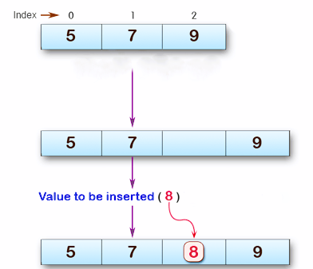

# Code Challenge 02 - insertShiftArray

## Description

The `insertShiftArray` function takes an integer array and a value to be inserted. The function returns a new array with the value inserted at the middle index, and the other elements shifted accordingly.

## Whiteboard Process



## Approach and Efficiency

The approach involves calculating the middle index of the original array, creating a new array with one additional slot, and then iterating through both arrays to fill in the values while considering the middle index as the insertion point. The space and time complexity of this approach is O(n), where n is the length of the original array.

## Stretch Goal - `removeShiftArray`

```
public static int[] removeShiftArray(int[] arr) {
    int mid = arr.length / 2;
    int[] newArr = new int[arr.length - 1];

    for (int i = 0; i < newArr.length; i++) {
        if (i < mid) {
            newArr[i] = arr[i];
        } else {
            newArr[i] = arr[i + 1];
        }
    }

    return newArr;
}
```

## Solution

How to Use

You can use the insertShiftArray function to insert a value into an array at the middle index. Here's an example of how to use it:

**Example**

Given Array: [4, 7, 2, 8]
Value to Insert: 5

**Expected Output:**

Given Array: [4, 7, 2, 8]

Value to Insert: 5

New Array: [4, 7, 2, 5, 8]

```

public static void main(String[] args) {
int[] inputArray = {4, 7, 2, 8};
int valueToInsert = 5;
int[] resultArray = insertShiftArray(inputArray, valueToInsert);

        System.out.println("Given Array: " + Arrays.toString(inputArray));
        System.out.println("Value to Insert: " + valueToInsert);
        System.out.println("New Array: " + Arrays.toString(resultArray));
    }


public static int[] insertShiftArray(int[] arr, int value) {
    int mid = arr.length / 2;
    int[] newArr = new int[arr.length + 1];

    for (int i = 0; i < newArr.length; i++) {
        if (i < mid) {
            newArr[i] = arr[i];
        } else if (i == mid) {
            newArr[i] = value;
        } else {
            newArr[i] = arr[i - 1];
        }
    }

    return newArr;
}
```
