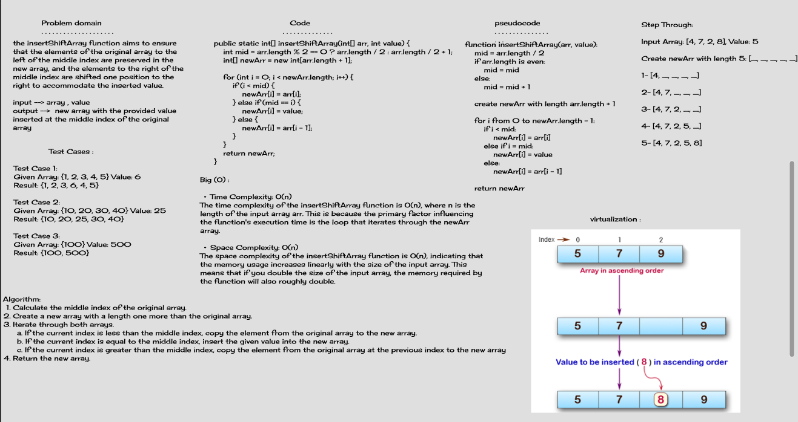

# Code Challenge 02 - array-insert-shift

## Whiteboard Process


## virtualization




## Stretch Goal
```
public static int[] removeShiftArray(int[] arr) {
    int mid = arr.length / 2;
    int[] newArr = new int[arr.length - 1];

    for (int i = 0; i < newArr.length; i++) {
        if (i < mid) {
            newArr[i] = arr[i];
        } else {
            newArr[i] = arr[i + 1];
        }
    }

    return newArr;
}
```

## Summary

This challenge involves creating a function to insert a value into an array at the middle index while shifting the remaining elements.

## Description

create the insertShiftArray function that takes an integer array and a value to be inserted. The function should return a new array with the value inserted at the middle index and the other elements shifted accordingly.

## Big(O)

B(O) -->  O(n) where n is the length of the original array.

### Unit Testing

Given Array --> {5, 7, 9} , value --> 8

Return New Array --> {5, 7, 8, 9}
