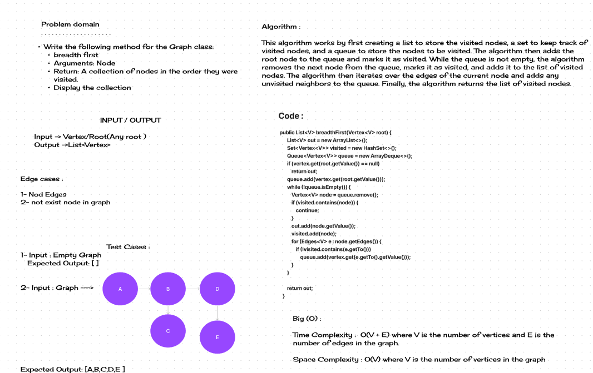

# Breadth-First Search

This code implements the breadth-first search (BFS) algorithm for traversing a graph. BFS is a graph search algorithm that starts at a given root node and explores all of its neighbors at the current depth level before moving on to the next depth level. This process is repeated until all of the nodes in the graph have been visited.

## Whiteboard Process



## Approach & Efficiency

The BFS algorithm is a very efficient algorithm for traversing graphs. It has a time complexity of O(V + E), where V is the number of vertices in the graph and E is the number of edges in the graph. This means that the algorithm's running time is proportional to the size of the graph.

## Solution

The `breadthFirst` function takes a vertex as input and returns a list of all the vertices in the graph in breadth-first order. The function first creates a list to store the visited vertices, a set to keep track of visited vertices, and a queue to store the vertices to be visited. The function then adds the root node to the queue and marks it as visited. While the queue is not empty, the function removes the next node from the queue, marks it as visited, and adds it to the list of visited vertices. The function then iterates over the edges of the current node and adds any unvisited neighbors to the queue. Finally, the function returns the list of visited vertices.

## Running the Solution

To run the BFS algorithm, you can call the `breadthFirst` function with the root node of the graph as input. The function will return a list of all the vertices in the graph in breadth-first order.

## Examples

```java
Graph<String> graph = new Graph<>();
        Vertex<String> root = graph.addVertex("A");
        graph.addVertex("B");
        graph.addVertex("C");
        graph.addVertex("D");
        graph.addEdge(root, graph.addVertex("E"));
        graph.addEdge(root, graph.addVertex("F"));
        graph.addEdge(graph.addVertex("G"), root);

        System.out.println(graph.breadthFirst(root));
}

