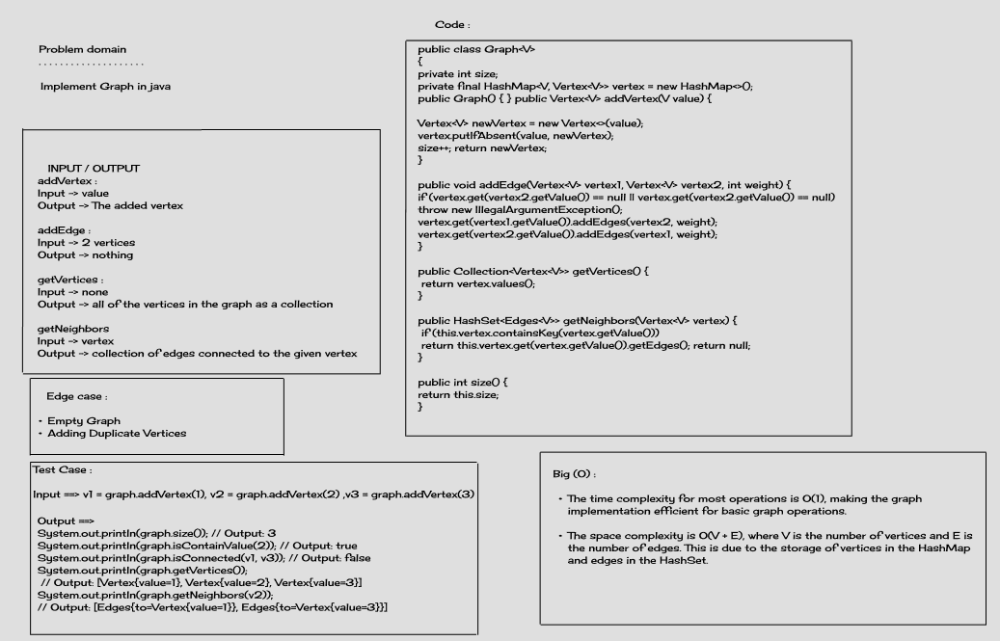

# Challenge Title : Graph 

## Whiteboard Process



## Approach & Efficiency
### Data Structure
- The graph is implemented using an adjacency list.
- Vertices are stored in a HashMap, where the key is the vertex value and the value is the corresponding Vertex object.
- Edges are represented as a HashSet of Edges in each Vertex object.

### Methods
1. **addVertex(V value):**
    - Adds a new vertex to the graph.
    - Time Complexity: O(1)

2. **addEdge(Vertex<V> vertex1, Vertex<V> vertex2, int weight):**
    - Adds a weighted edge between two vertices.
    - Time Complexity: O(1)

3. **addEdge(Vertex<V> vertex1, Vertex<V> vertex2):**
    - Adds an unweighted edge between two vertices.
    - Time Complexity: O(1)

4. **getVertices():**
    - Returns a collection of all vertices in the graph.
    - Time Complexity: O(1)

5. **getNeighbors(Vertex<V> vertex):**
    - Returns a HashSet of edges connected to the specified vertex.
    - Time Complexity: O(1)

6. **size():**
    - Returns the number of vertices in the graph.
    - Time Complexity: O(1)

7. **isContainVertex(Vertex<V> vertex):**
    - Checks if the graph contains a specific vertex.
    - Time Complexity: O(1)

8. **isContainValue(V value):**
    - Checks if the graph contains a vertex with a specific value.
    - Time Complexity: O(1)

9. **isConnected(Vertex<V> vertex, Vertex<V> connectedVertex):**
    - Checks if there is a connection (edge) between two vertices.
    - Time Complexity: O(E), where E is the number of edges.

## Solution

### Example How to Run

```java
Graph<Integer> integerGraph = new Graph<>();

        Vertex<Integer> v1 = integerGraph.addVertex(1);
        Vertex<Integer> v2 = integerGraph.addVertex(2);
        Vertex<Integer> v3 = integerGraph.addVertex(3);

        integerGraph.addEdge(v1, v2, 4);
        integerGraph.addEdge(v2, v3, 5);

        System.out.println(integerGraph.isContainVertex(v1)); // true
        System.out.println("**************************************");
        System.out.println(integerGraph.isConnected(v1, v2)); // true
        System.out.println("**************************************");
        Collection<Vertex<Integer>> vertices = integerGraph.getVertices(); // [1 edges -> [1  connected to 2 weight: 4], 2 edges -> [2  connected to 3 weight: 5, 2  connected to 1 weight: 4], 3 edges -> [3  connected to 2 weight: 5]]

        System.out.println(vertices);
```