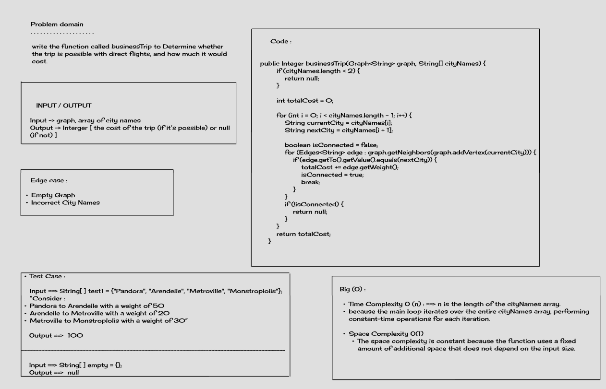

# Business Trip Function - CC 37

## Description
The `businessTrip` function determines the cost of a business trip based on a provided graph representing flight connections between cities and an array of city names representing the trip itinerary. The function calculates the total cost of the trip if it's possible, considering direct flights between cities.

## Whiteboard Process


## Approach & Efficiency
The function follows :

1. Check if the length of the `cityNames` array is less than 2. If true, return null, as a trip with less than two cities is not possible.

2. Iterate through the `cityNames` array, and for each pair of consecutive cities, check if there is a direct flight connection in the provided graph.

3. If a direct flight connection exists, add the cost to the total cost variable. If not, return null, as the trip is not possible.

4. Return the total cost of the trip.

The time complexity of the function is O(n), where n is the length of the `cityNames` array, as it iterates through the array once.

## Solution
To use the `businessTrip` function, create an instance of the `Graph` class, add vertices representing cities, add edges with or without weights to represent flight connections, and then call the function with the graph and an array of city names.

## Examples

Here are some examples of using the `businessTrip` function:

```java
 Graph<String> stringGraph = new Graph<>();
        Vertex<String> node = new Vertex<>("Pandora");
        Vertex<String> node2 = new Vertex<>("Arendelle");
        Vertex<String> node3 = new Vertex<>("Metroville");
        Vertex<String> node4 = new Vertex<>("Monstroplolis");
        Vertex<String> node5 = new Vertex<>("Narnia");
        Vertex<String> node6 = new Vertex<>("Naboo");
        stringGraph.addVertex("Pandora");
        stringGraph.addVertex("Arendelle");
        stringGraph.addVertex("Metroville");
        stringGraph.addVertex("Monstroplolis");
        stringGraph.addVertex("Narnia");
        stringGraph.addVertex("Naboo");


        stringGraph.addEdge(node, node2,50);
        stringGraph.addEdge(node2, node3,20);
        stringGraph.addEdge(node4, node3);
        stringGraph.addEdge(node4, node6);
        stringGraph.addEdge(node3, node6);
        stringGraph.addEdge(node3, node5);

        System.out.println(stringGraph.businessTrip(stringGraph, new String[]{"Pandora", "Arendelle", "Metroville"})); // will return 70 (20 + 50)
        System.out.println(stringGraph.businessTrip(stringGraph,new String[]{"Pandora","Naboo"})); // will return null

```
   