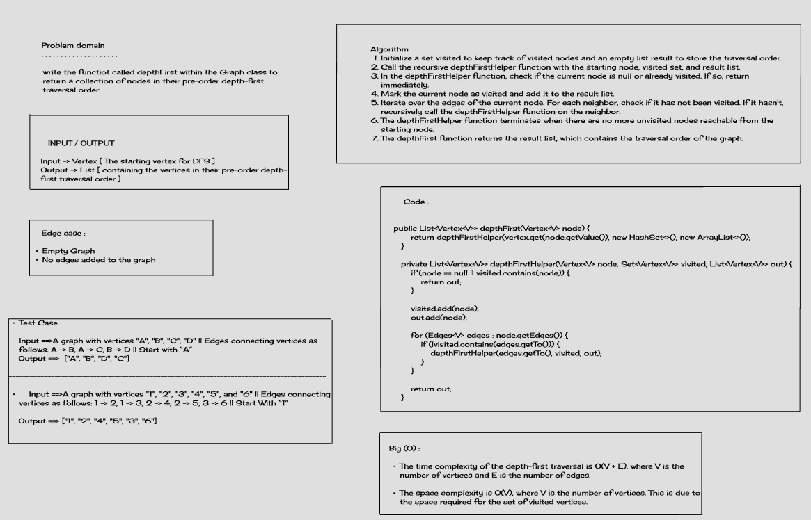

# Depth-First Search (DFS) - CC 38

## Challenge Title
Depth-First Search (DFS) is a graph traversal algorithm that explores a graph by recursively visiting all nodes reachable from a starting node. This algorithm can be used to find connected components, determine if a graph is connected, and detect cycles in a graph.

## Whiteboard Process


## Approach & Efficiency

I implemented depth-first traversal using a recursive approach. The algorithm maintains a set of visited vertices to prevent revisiting the same vertex. It explores each branch as deeply as possible before backtracking.

### Methods:
1. **`depthFirst(node)`**:
    - Initializes the set of visited vertices and the list for the traversal order.
    - Calls the private helper method `depthFirstHelper(node, visited, traversalOrder)`.
    - Returns the traversal order list.

2. **`depthFirstHelper(node, visited, traversalOrder)`**:
    - Recursively performs depth-first traversal.
    - Adds the current node to the traversal order.
    - Marks the node as visited.
    - Iterates through the neighbors of the current node and recursively calls the method for unvisited neighbors.

### Time Complexity:
- The time complexity of the depth-first traversal is O(V + E), where V is the number of vertices and E is the number of edges.

### Space Complexity:
- The space complexity is O(V), where V is the number of vertices. This is due to the space required for the set of visited vertices.

## Solution

To run the code, you can create a new instance of the Vertex class and call the depthFirst method on it. For example:

Example:
```java
Graph<String> graph = new Graph<>();
Vertex<String> A = graph.addVertex("A");
Vertex<String> B = graph.addVertex("B");
Vertex<String> C = graph.addVertex("C");

graph.addEdge(A, B);
graph.addEdge(B, C);

List<Vertex<String>> depthFirstResult = graph.depthFirst(A);
System.out.println(depthFirstResult);
```

Expected Output:
```
[A, B, C]
```
