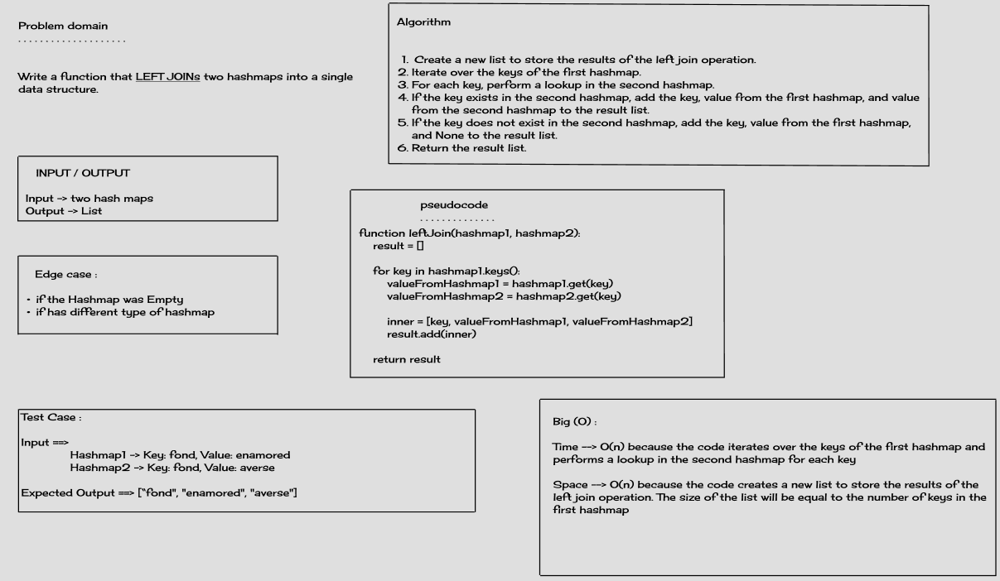

### README

**Challenge Title:** Left Join

**Description:**

Implement a simplified Left Join for 2 Hashmaps

**Whiteboard Process:**



**Approach & Efficiency:**

The approach I took for this challenge was to iterate over the keys of the first hashmap and perform a lookup in the second hashmap for each key. If the key exists in the second hashmap, I added the key, value from the first hashmap, and value from the second hashmap to a result list. If the key does not exist in the second hashmap, I added the key, value from the first hashmap, and `null` to the result list.

This approach is efficient because it has a time complexity of O(n) and a space complexity of O(n).

**Solution:**

Here is an example of how to use the code:

``` java
 HashMap<String, String> synonymsHashmap = new HashMap<>(5);
        synonymsHashmap.set("diligent", "employed");
        synonymsHashmap.set("fond", "enamored");
        synonymsHashmap.set("guide", "usher");
        synonymsHashmap.set("outfit", "garb");
        synonymsHashmap.set("wrath", "anger");

        HashMap<String, String> antonymsHashmap = new HashMap<>(5);
        antonymsHashmap.set("diligent", "idle");
        antonymsHashmap.set("fond", "averse");
        antonymsHashmap.set("guide", "follow");
        antonymsHashmap.set("flow", "jam");
        antonymsHashmap.set("wrath", "delight");

        List<List<String>> result = leftJoin(synonymsHashmap, antonymsHashmap);
        System.out.println(result);
}
```

Output:

```
[diligent, employed, idle]
[wrath, anger, delight]
[guide, usher, follow]
[font, enamored, averse]
[outfit, garb, null]
```