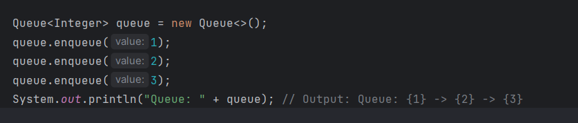

# Stack and Queue

## Challenge Description
In this challenge, I implemented both a Stack and a Queue data structure using a Linked List as the underlying data storage mechanism. These data structures have the following features:

## Whiteboard

### Node
- A `Node` class with properties for the value stored in the Node and a pointer to the next node.

### Stack
- A `Stack` class with a top property. It creates an empty Stack when instantiated.
- The class contains methods for:
    - `push(value)`: Adds a new node with that value to the top of the stack with O(1) time performance.
    - `pop()`: Removes and returns the value from the node at the top of the stack.
    - `peek()`: Returns the value of the node located at the top of the stack.
    - `isEmpty()`: Returns a boolean indicating whether the stack is empty.
    - `toString`: print all the data in the stack.

### Queue
- A `Queue` class with a front and back property. It creates an empty Queue when instantiated.
- The class contains methods for:
    - `enqueue(value)`: Adds a new node with that value to the back of the queue with O(1) time performance.
    - `dequeue()`: Removes and returns the value from the node at the front of the queue.
    - `peek()`: Returns the value of the node located at the front of the queue.
    - `isEmpty()`: Returns a boolean indicating whether the queue is empty.
    - `toString`: print all the data in the queue.

## Approach & Efficiency
### Stack
- For the Stack, I used a singly-linked list where each new element is pushed onto the top of the stack. The push and pop operations have a time complexity of O(1) since they directly access the top of the stack.

### Queue
- For the Queue, I also used a singly-linked list where each new element is enqueued at the rear of the queue. The enqueue and dequeue operations have a time complexity of O(1) since they directly access the front and rear of the queue.

## Solution
To run and test the code:

1. Clone this repository to your local machine.
2. Compile the Java files.
3. Create instances of the Stack and Queue classes and use the provided methods to interact with them.
4. Run test cases to ensure that the functionality is working correctly.

### Example:

