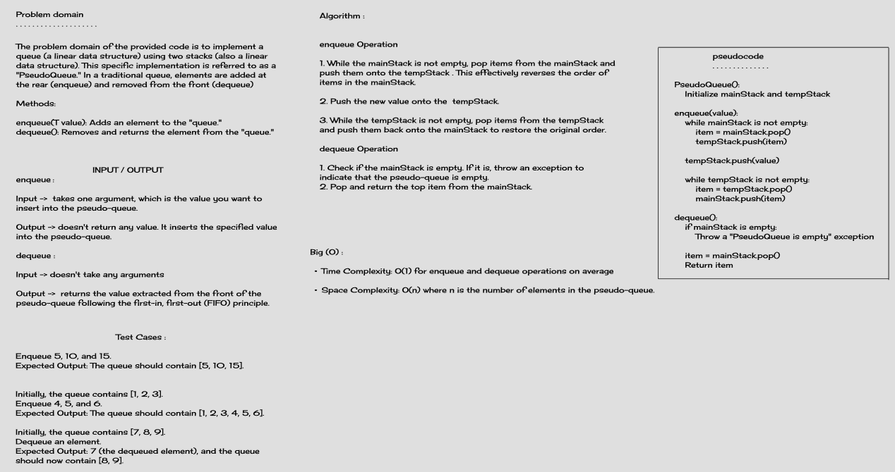
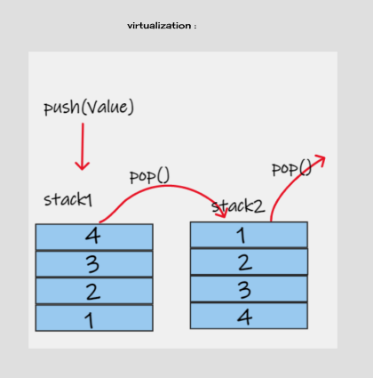

# PseudoQueue

**PseudoQueue**: Simulate a queue using two stacks.

## Whiteboard Process




## Approach & Efficiency

The `PseudoQueue` class efficiently simulates a queue using two stacks. The key operations, `enqueue` and `dequeue`, have the following time and space complexity:

- Time Complexity: O(1) for enqueue and dequeue operations on average.
- Space Complexity: O(n) where n is the number of elements in the pseudo-queue.

## solution


### `PseudoQueue()`

Constructor to create a new instance of the `PseudoQueue` class.

### `enqueue(value: T)`

Enqueues the specified value into the pseudo-queue.

- `value`: The value to be enqueued.

### `dequeue(): T`

Dequeues and returns the value from the front of the pseudo-queue.

### `isEmpty(): boolean`

Checks if the pseudo-queue is empty and returns `true` if it is, `false` otherwise.

## Example

```
PseudoQueue<Integer> pseudoQueue = new PseudoQueue<>();

pseudoQueue.enqueue(5);
pseudoQueue.enqueue(10);
pseudoQueue.enqueue(15);

int dequeuedValue = pseudoQueue.dequeue(); // dequeuedValue will be 5
```