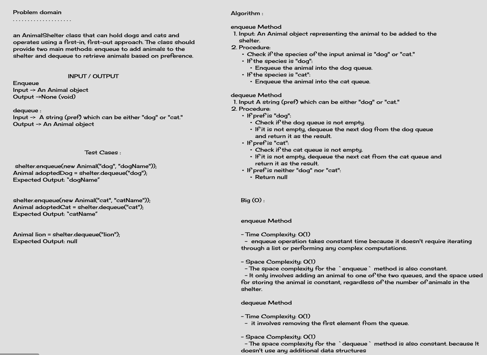
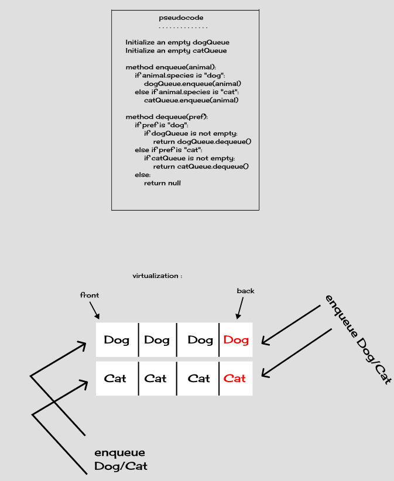
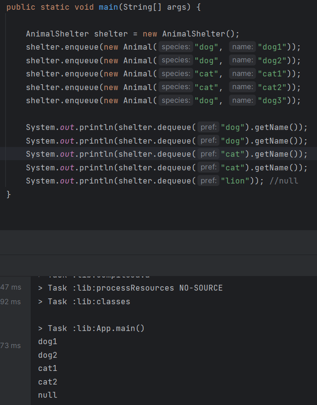

# Animal Shelter Queue

## Description

This coding challenge involves implementing an `AnimalShelter` class that can hold dogs and cats and operate using a first-in, first-out approach. The class provides two main methods: `enqueue` to add animals to the shelter and `dequeue` to retrieve animals based on preference.

## Whiteboard Process

## Approach & Efficiency

### `enqueue` Method

- In the `enqueue` method, we check the species of the animal (either "dog" or "cat") and add it to the respective queue.
- The time complexity for `enqueue` is O(1) as it involves a simple enqueue operation on a queue data structure.
- The space complexity for `enqueue` is O(1) because we only add an animal to the queue.

### `dequeue` Method

- The `dequeue` method takes a preference (`"dog"` or `"cat"`) as input and retrieves the next available animal of that preference.
- The time complexity for `dequeue` is O(1) on average, as we directly dequeue an animal from the respective queue.
- The space complexity for `dequeue` is O(1) because it doesn't involve any additional data structures.

## Example Usage

