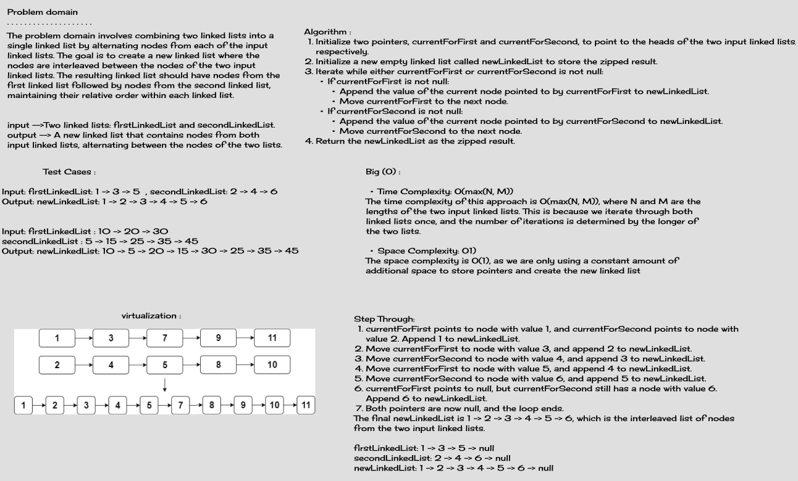

# Zip Linked-Lists

## Description
You are given two linked lists. Your task is to write a function called `zipLists` that takes in two linked lists as arguments and returns a new linked list by "zipping" the two lists together. Zipping means that the nodes alternate between the two lists. The function should return a reference to the new zipped list.

For example, if you have the following linked lists:

List 1 : 1 -> 3 -> 5 -> NULL

List 2 : 2 -> 4 -> 6 -> NULL

The zipped list should be : 1 -> 2 -> 3 -> 4 -> 5 -> 6 -> NULL

## Whiteboard




## Approach & Efficiency

The approach taken to solve the "Zip Linked Lists" challenge involves iterating through both input linked lists simultaneously and alternately appending nodes from each list to a new linked list. The goal is to create a new linked list where nodes from the two input lists are interleaved.

The time complexity of this approach is O(max(N, M)), where N and M are the lengths of the two input linked lists. This is because we iterate through both linked lists once, and the number of iterations is determined by the longer of the two lists.

The space complexity is O(1), as we are only using a constant amount of additional space to store pointers and create the new linked list

## Solution

Here is the implementation of the `zipLists` function:

``` java
public LinkedList<T> zipLists(LinkedList<T> firstLinkedList,LinkedList<T> secondLinkedList){
        if(firstLinkedList.isEmpty()){
        return secondLinkedList;
        }
        if(secondLinkedList.isEmpty()){
        return firstLinkedList;
        }

        LinkedList<T> newLinkedList=new LinkedList<>();
        Node<T> currentForFirst=firstLinkedList.head;
        Node<T> currentForSecond=secondLinkedList.head;

        while(currentForFirst!=null||currentForSecond!=null){
        if(currentForFirst!=null){
        newLinkedList.append(currentForFirst.value);
        currentForFirst=currentForFirst.next;
        }
        if(currentForSecond!=null){
        newLinkedList.append(currentForSecond.value);
        currentForSecond=currentForSecond.next;
        }
        }

        return newLinkedList;
        }
```

You can use the `zipLists` function to combine two linked lists as described in the challenge. Here's an example of how
to use the function:

``` java
        LinkedList<Integer> linkedList1 = new LinkedList<>();
        linkedList1.append(1);
        linkedList1.append(3);
        linkedList1.append(5);
        
        LinkedList<Integer> linkedList2 = new LinkedList<>();
        linkedList2.append(2);
        linkedList2.append(4);
        linkedList2.append(6);

        LinkedList<Integer> linkedList3 = new LinkedList<>();
        linkedList3.zipLists(linkedList1, linkedList2);
```

Output:

```
{1} -> {2} -> {3} -> {4} -> {5} -> {6} -> NULL
```
