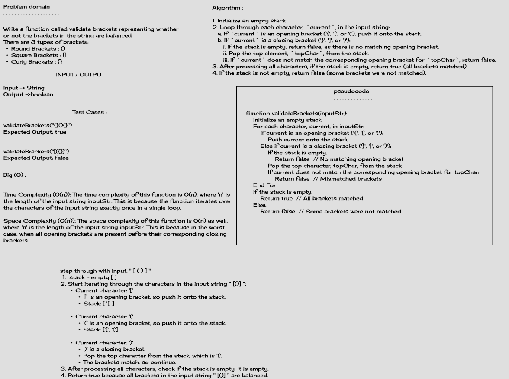
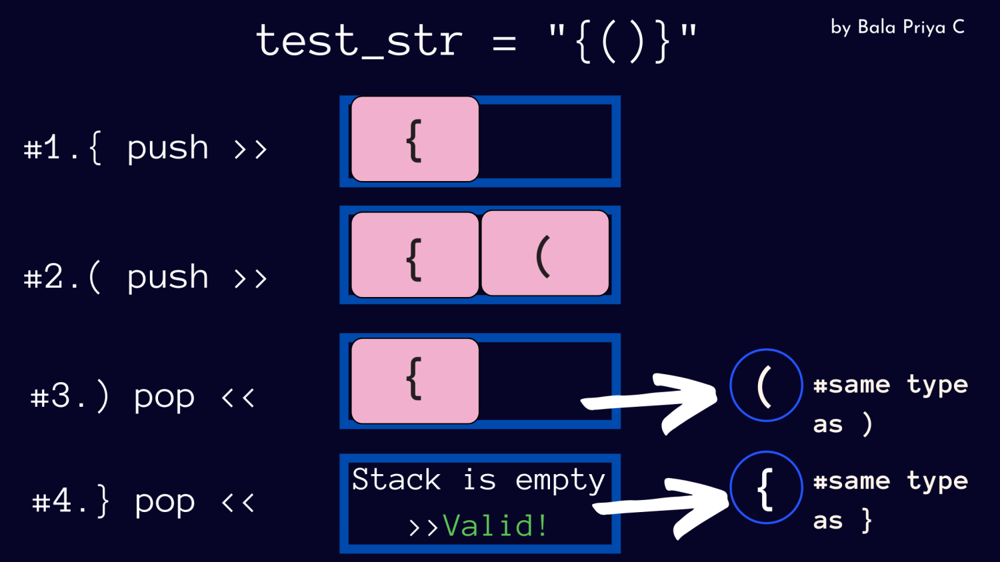

# Validate Brackets

## Description

The challenge is to write a function that checks whether a given string containing brackets ( '()' , '[]' , '{}') has balanced brackets or not. The function should return `true` if the brackets are balanced and `false` if they are not.
## Whiteboard Process




## Approach & Efficiency

The approach is to use a stack data structure to keep track of the opening brackets while iterating through the input string. When a closing bracket is encountered, we check if it matches the top of the stack. If it does, we pop the stack; otherwise, the brackets are not balanced.

**Time Complexity**: O(n) - Linear time complexity because we iterate through the string once.

**Space Complexity**: O(n) - Linear space complexity because, in the worst case, the stack can store all opening brackets.

## Example Usage

```java

public class StackQueueBrackets {
    public static boolean validateBrackets(String inputStr) {

        Stack<Character> stack = new Stack<>();

        for (char current : inputStr.toCharArray()) {
            if (current == '{' || current == '[' || current == '(') {
                stack.push(current);
            } else if (current == '}' || current == ']' || current == ')') {
                if (stack.isEmpty()) {
                    return false;
                }
                char topChar = stack.pop();
                if ((current == '}' && topChar != '{') || (current == ']' && topChar != '[') || (current == ')' && topChar != '(')) {
                    return false;
                }
            }
        }
        return stack.isEmpty();
    }

}
       
```

**Solution**:

``` java

 StackQueueBrackets stackQueueBrackets = new StackQueueBrackets();

        System.out.println(stackQueueBrackets.validateBrackets("{}")); // true
        System.out.println(stackQueueBrackets.validateBrackets("{}(){}")); // true
        System.out.println(stackQueueBrackets.validateBrackets("()[[Extra Characters]]")); // true
        System.out.println(stackQueueBrackets.validateBrackets("(){}[[]]")); // true
        System.out.println(stackQueueBrackets.validateBrackets("{}{Code}[Fellows](())")); // true
        System.out.println(stackQueueBrackets.validateBrackets("[({}]")); // false
        System.out.println(stackQueueBrackets.validateBrackets("(](")); // false
        System.out.println(stackQueueBrackets.validateBrackets("([{(})])")); // false
```