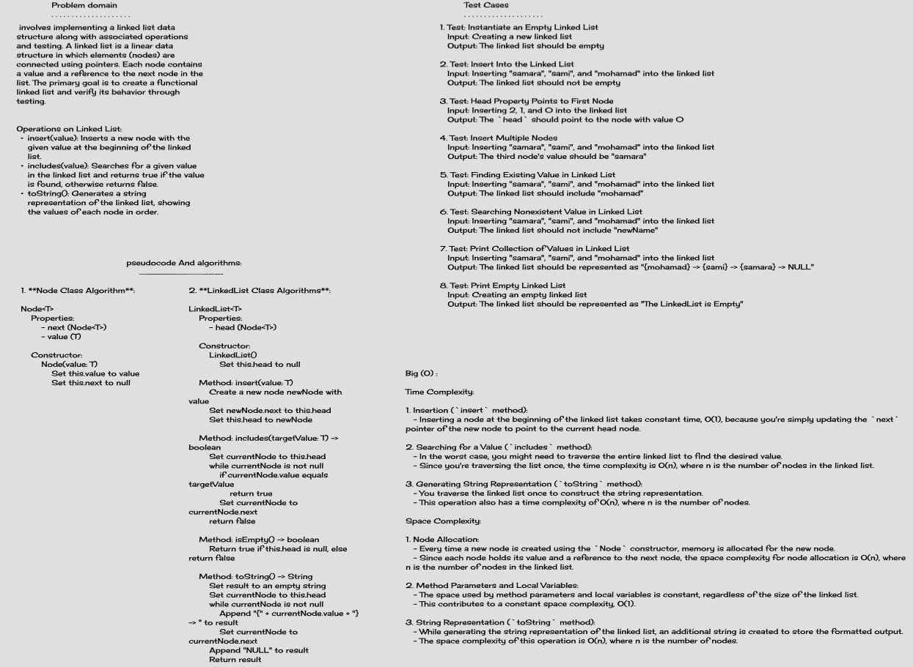

## Singly Linked List

You can create Linked list and manipulate it.

## Descriptions

**Node Class Description**:

The `Node` class represents a single node in a linked list. Each node contains a value and a reference to the next node in the list.

- Properties:
    - `next`: A reference to the next node in the linked list.
    - `value`: The value held by the node.

- Constructor:
    - `Node(value: T)`: Initializes a new node with the given value. The `next` reference is set to `null`.

**LinkedList Class Description**:

The `LinkedList` class implements a basic linked list data structure, where nodes are linked sequentially using their `next` references. It provides methods to insert elements at the beginning, search for values, check if the list is empty, and generate a string representation of the list.

- Properties:
    - `head`: A reference to the first node in the linked list.

- Constructor:
    - `LinkedList()`: Initializes an empty linked list with a `null` head reference.

- Method: `insert(value: T)`:
    - Inserts a new node with the given value at the beginning of the linked list.
    - Algorithm:
        1. Create a new node `newNode` with the given value.
        2. Set the `next` reference of `newNode` to the current `head`.
        3. Update the `head` to point to `newNode`.

- Method: `includes(targetValue: T)`:
    - Searches for a specific value within the linked list.
    - Algorithm:
        1. Initialize `currentNode` to the `head`.
        2. Iterate through the list:
            - If the `value` of `currentNode` matches the `targetValue`, return `true`.
            - Move `currentNode` to the next node.
        3. If no match is found, return `false`.

- Method: `isEmpty()`:
    - Checks if the linked list is empty.
    - Returns `true` if the `head` is `null`, indicating an empty list; otherwise, returns `false`.

- Method: `toString()`:
    - Generates a string representation of the linked list.
    - 
    - Algorithm:
        1. Initialize `result` as an empty string.
        2. Initialize `currentNode` to the `head`.
        3. Traverse the linked list:
            - Append `"{value}" -> ` to `result`, where `value` is the value of the current node.
            - Move `currentNode` to the next node.
        4. Append `"NULL"` to `result`.
        5. Return the final `result`.

## white Board

## Approach & Efficiency

The linked list implementation follows a basic approach where each node holds a value and a reference to the next node in the list. The linked list class provides methods to insert elements at the beginning, search for values, check if the list is empty, and generate a string representation of the list.

## [LINK TO CODE](https://github.com/MohamadSamara/data-structures-and-algorithms/tree/main/linkedlist/lib/src/main/java/datastructures/linkedlist)