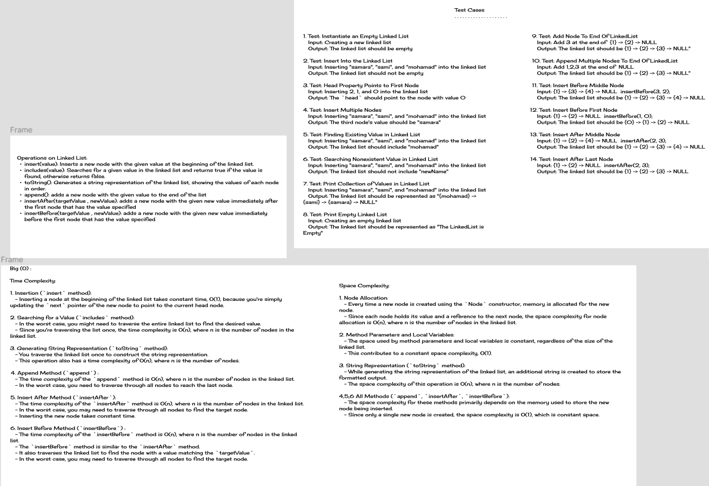
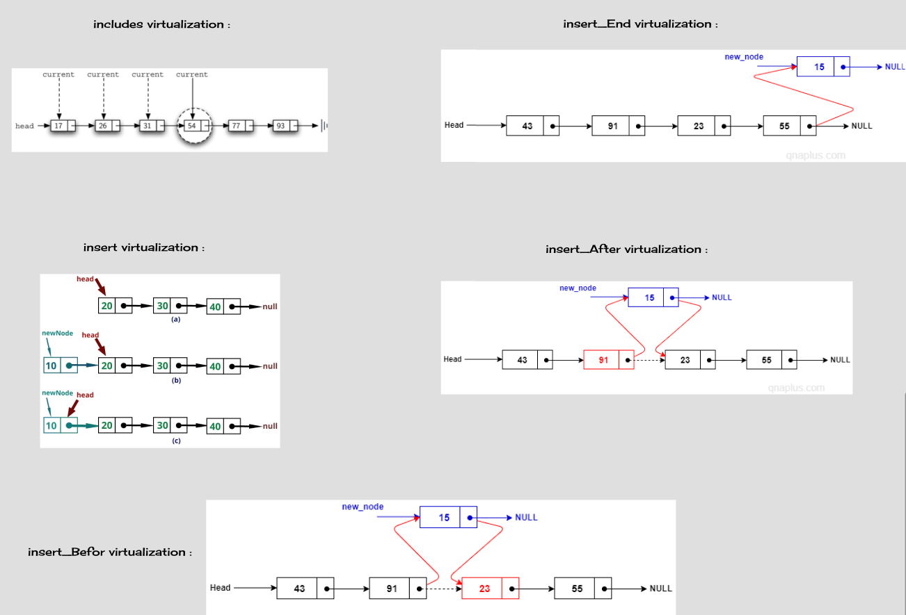

## Singly Linked List

You can create Linked list and manipulate it.

## Descriptions

**Node Class Description**:

The `Node` class represents a single node in a linked list. Each node contains a value and a reference to the next node in the list.

- Properties:
    - `next`: A reference to the next node in the linked list.
    - `value`: The value held by the node.

- Constructor:
    - `Node(value: T)`: Initializes a new node with the given value. The `next` reference is set to `null`.

**LinkedList Class Description**:

The `LinkedList` class implements a basic linked list data structure, where nodes are linked sequentially using their `next` references. It provides methods to insert elements at the beginning, search for values, check if the list is empty, and generate a string representation of the list.

- Properties:
    - `head`: A reference to the first node in the linked list.

- Constructor:
    - `LinkedList()`: Initializes an empty linked list with a `null` head reference.

- Method: `insert(value: T)`:
    - Inserts a new node with the given value at the beginning of the linked list.
    - Algorithm:
        1. Create a new node `newNode` with the given value.
        2. Set the `next` reference of `newNode` to the current `head`.
        3. Update the `head` to point to `newNode`.

- Method: `includes(targetValue: T)`:
    - Searches for a specific value within the linked list.
    - Algorithm:
        1. Initialize `currentNode` to the `head`.
        2. Iterate through the list:
            - If the `value` of `currentNode` matches the `targetValue`, return `true`.
            - Move `currentNode` to the next node.
        3. If no match is found, return `false`.

- Method: `isEmpty()`:
    - Checks if the linked list is empty.
    - Returns `true` if the `head` is `null`, indicating an empty list; otherwise, returns `false`.

- Method: `toString()`:
    - Generates a string representation of the linked list.
    - Algorithm:
        1. Initialize `result` as an empty string.
        2. Initialize `currentNode` to the `head`.
        3. Traverse the linked list:
            - Append `"{value}" -> ` to `result`, where `value` is the value of the current node.
            - Move `currentNode` to the next node.
        4. Append `"NULL"` to `result`.
        5. Return the final `result`.

- Method: `append(value: T)`
    - The `append` method adds a new node with the given value to the end of the linked list. This operation is useful when you want to expand the linked list by placing new elements at the end.
    - Algorithm:
        1. Create a new node `newNode` with the provided value.
        2. If the linked list is empty (i.e., `head` is `null`), set `head` to point to `newNode`.
        3. Otherwise, traverse the linked list starting from the `head` until the last node is reached (i.e., a node with `next` pointing to `null`).
        4. Set the `next` reference of the last node to point to `newNode`.

- Method: `insertBefore(targetValue: T, newValue: T)`
    - The `insertBefore` method inserts a new node with the specified `newValue` immediately before the first occurrence of the `targetValue` in the linked list. This operation is useful for adding elements in a specific position.
      - Algorithm:
          1. Create a new node `newNode` with the provided `newValue`.
          2. If the linked list is empty (i.e., `head` is `null`), print an error message indicating that insertion is not possible.
          3. If the `value` of the `head` matches the `targetValue`, set the `next` reference of `newNode` to the `head`, and update `head` to point to `newNode`.
          4. Otherwise, traverse the linked list starting from the `head` until the node before the target node is reached (i.e., a node with `next` pointing to the node with `value` matching `targetValue`).
          5. Set the `next` reference of `newNode` to point to the node referenced by the `next` reference of the current node.
          6. Set the `next` reference of the current node to point to `newNode`.

- Method: `insertAfter(targetValue: T, newValue: T)`
    - The `insertAfter` method inserts a new node with the specified `newValue` immediately after the first occurrence of the `targetValue` in the linked list. This operation is useful for adding elements in a specific position.
      - Algorithm:
          1. Create a new node `newNode` with the provided `newValue`.
          2. If the linked list is empty (i.e., `head` is `null`), print an error message indicating that insertion is not possible.
          3. Traverse the linked list starting from the `head`:
              - If the `value` of the current node matches the `targetValue`, set the `next` reference of `newNode` to the `next` reference of the current node.
              - Set the `next` reference of the current node to point to `newNode`.
              - Return from the method, as the insertion is complete.
          4. If no node with a value matching the `targetValue` is found during traversal, print an error message indicating that insertion is not possible.

## white Board

### Update some Feature

## Approach & Efficiency

The linked list implementation follows a basic approach where each node holds a value and a reference to the next node in the list. The linked list class provides methods to insert elements at the beginning, search for values, check if the list is empty, and generate a string representation of the list.

## [LINK TO CODE](https://github.com/MohamadSamara/data-structures-and-algorithms/tree/main/linkedlist/lib/src/main/java/datastructures/linkedlist)
