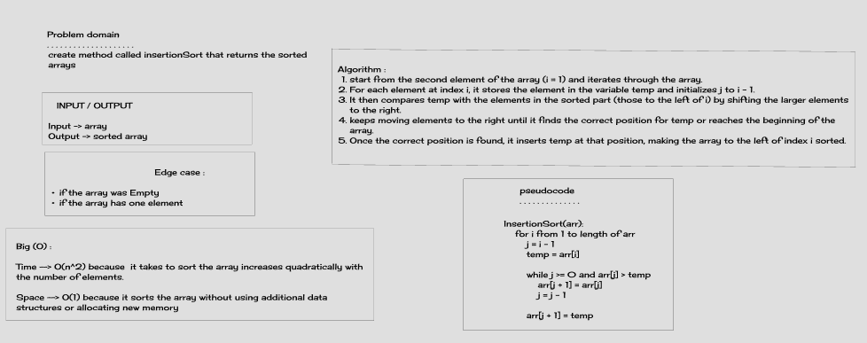
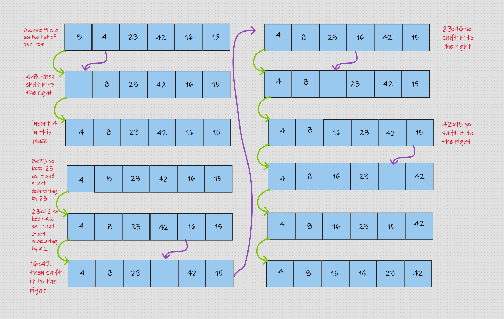

# Insertion Sort

# Challenge
#### We are tasked with implementing the Insertion Sort algorithm in the Java programming language and analyzing its time and space complexity

## Whiteboard Process

## Visual Process

## Approach & Efficiency
#### The approach I go is increase my skill to step over the algorithm step by step and recorde the result and make table contain the variables and its values at iterating moment

## Solution
### Go [here](https://github.com/MohamadSamara/data-structures-and-algorithms/blob/main/sorting/app/src/main/java/sorting/app/insertion/App.java) and check my code .
