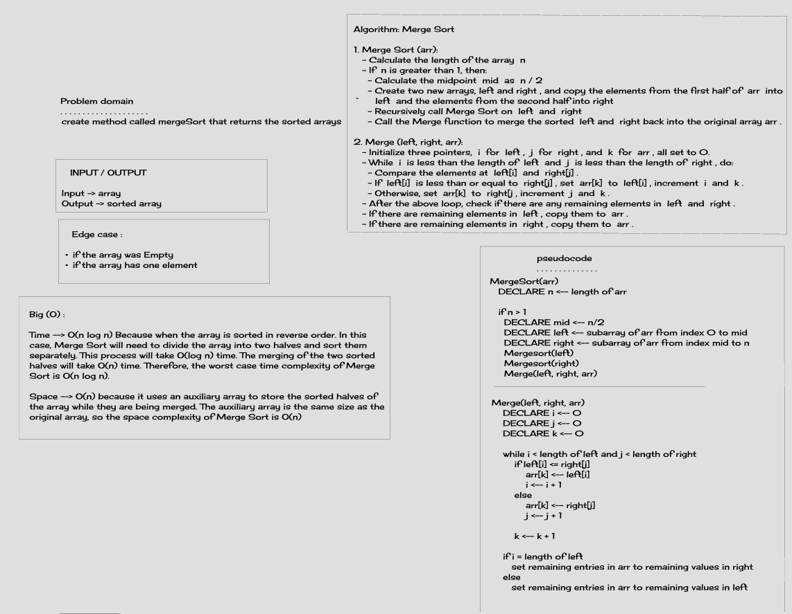
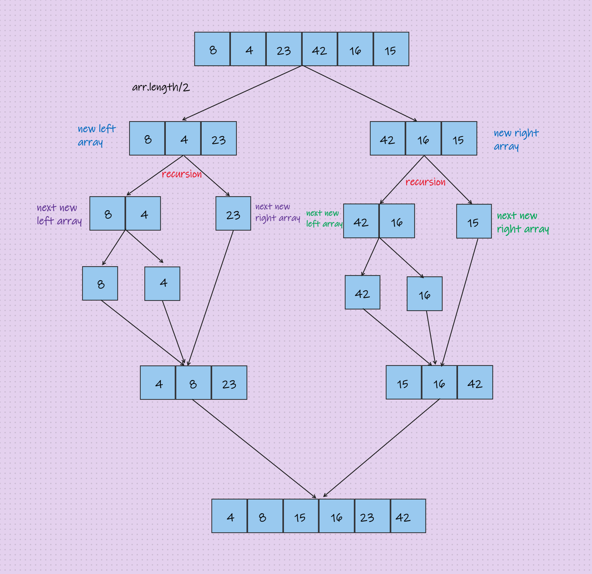

# Merge Sort

Sorting an array by dividing it in half numerous times until it is sorted and merge-able, and then merging it.

## Challenge

create method called mergeSort that returns the sorted arrays

## Whiteboard

### Visual steps

## Solution
### Go [here](./sorting/app/src/main/java/sorting/app/merge/App.java) and check my code