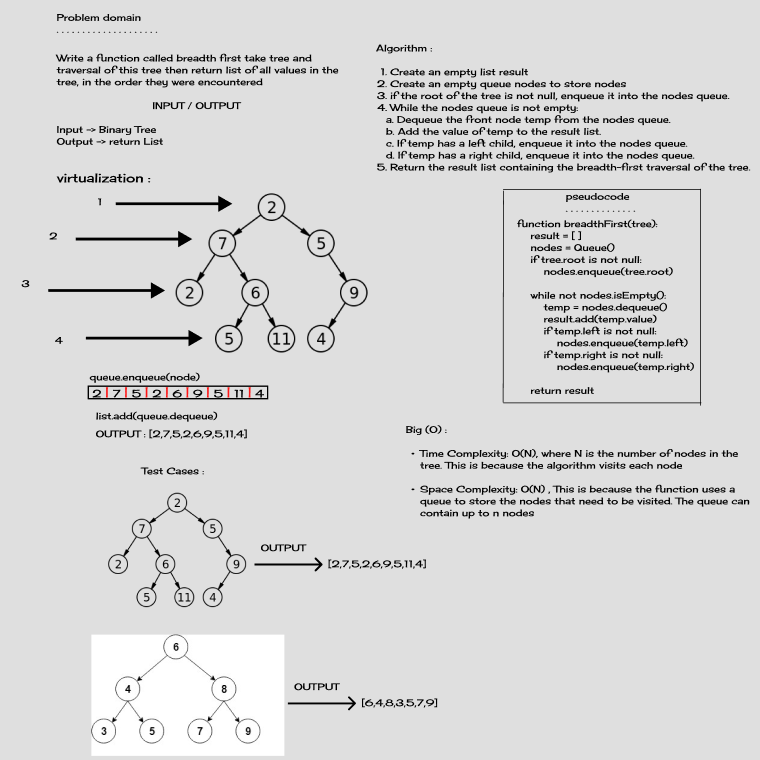
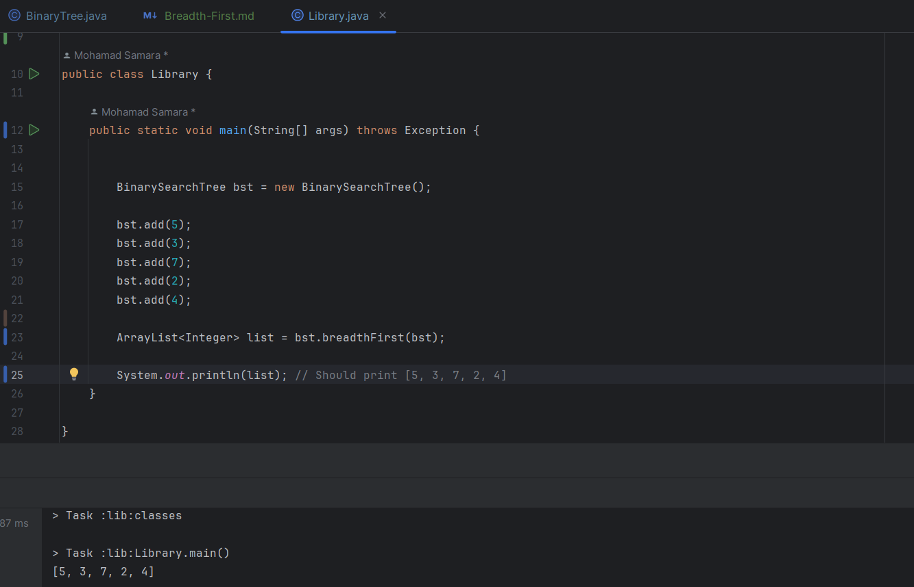

# Challenge Title
Breadth-First Traversal

## Description of the Challenge
The challenge is to implement a breadth-first traversal of a binary tree and return a list of all node values in the order they were encountered.

## Whiteboard Process

## Approach & Efficiency
I have implemented a breadth-first traversal of the binary tree using a queue data structure. The approach is as follows:
1. Create an empty list `result` to store the traversal result.
2. Create an empty queue `nodes` to store nodes for traversal.
3. Enqueue the root node into the `nodes` queue (if it exists).
4. While the `nodes` queue is not empty:
   a. Dequeue a node `temp` from the `nodes` queue.
   b. Add the value of `temp` to the `result` list.
   c. Enqueue left child (if exists) into the `nodes` queue.
   d. Enqueue right child (if exists) into the `nodes` queue.
5. Return the `result` list containing the breadth-first traversal.

- Time Complexity and Space Complexity : O(N), where N is the number of nodes in the tree.

## Solution
To run the code for the binary tree breadth-first traversal, follow these steps:

1. Create an instance of the `BinarySearchTree` class.
2. Add nodes to the binary tree using the `add` methode.
3. Call the `breadthFirst()` method on the Binary Search Tree instance to get the breadth-first traversal result.

Example and Solution:

