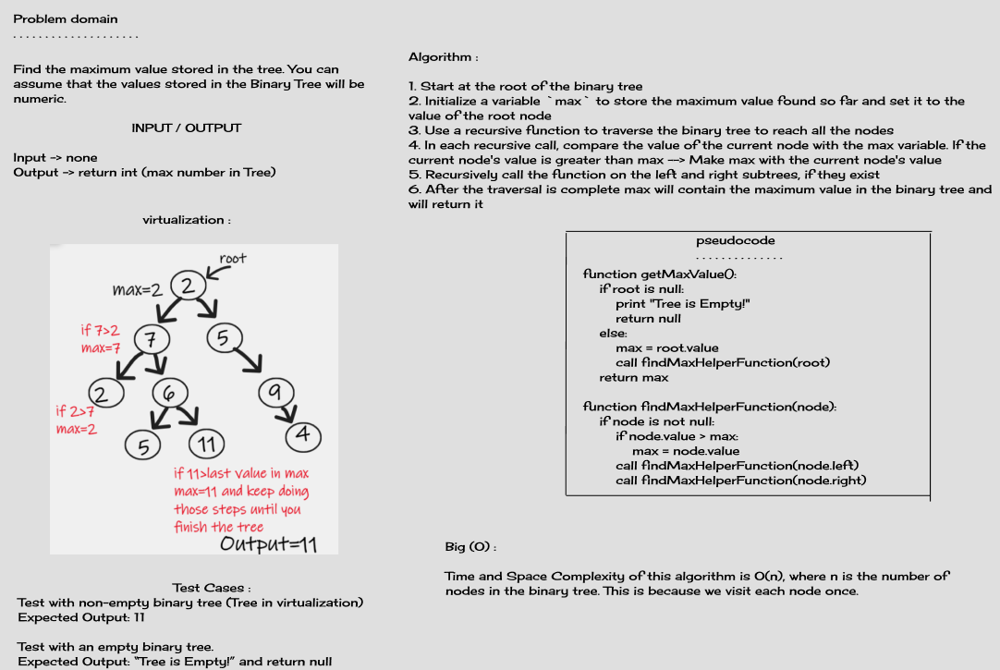
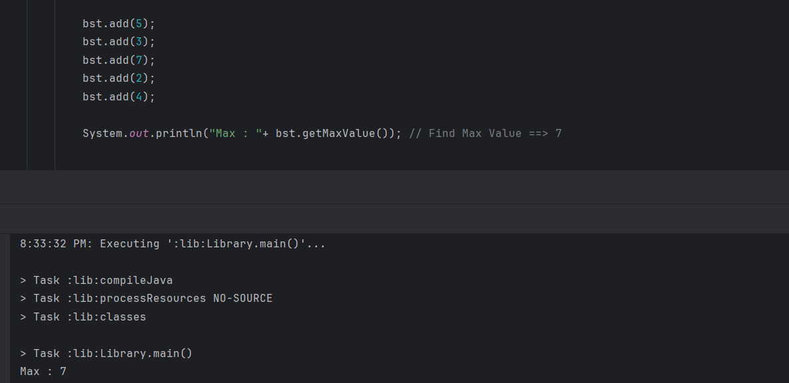

# Find Max Value

## Description

implementing a method that can search the entire binary tree and identify the highest numeric value present in the tree. This method should traverse the tree and return the maximum value it encounters during the traversal

## Whiteboard Process



## Approach & Efficiency
- **Approach**: Recursive traversal of the binary tree to find the maximum value. It starts with the root node's value as the initial maximum and updates it as it traverses the tree.
- **Time Complexity**: O(n) in the average case (balanced tree), O(n) in the worst case (unbalanced tree).
- **Space Complexity**: O(n) in the worst case for an unbalanced tree.

## Solution

```java
    private int max = 0;
    public Integer getMaxValue(){
        if (root == null) {
            System.out.println("Tree is Empty!");
            return null;
        }
        else {
            max = root.value;
            findMaxHelperFunction(root);
        }
        return max;
    }

    private void findMaxHelperFunction(Node<Integer> node){
        if(node != null) {
            if(node.value > max){
                max = node.value;
            }
            findMaxHelperFunction(node.left);
            findMaxHelperFunction(node.right);
        }
    }
```


