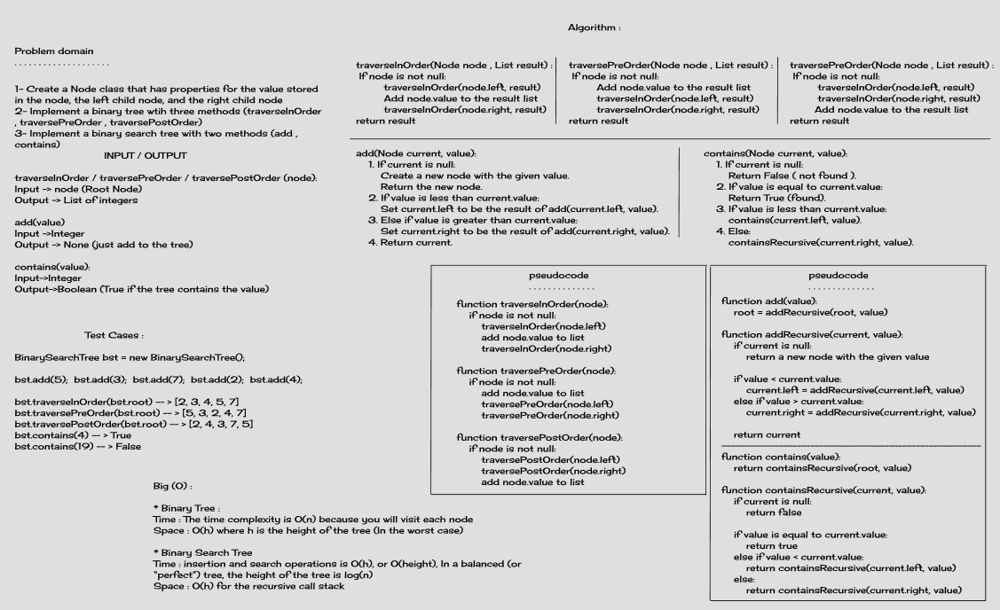
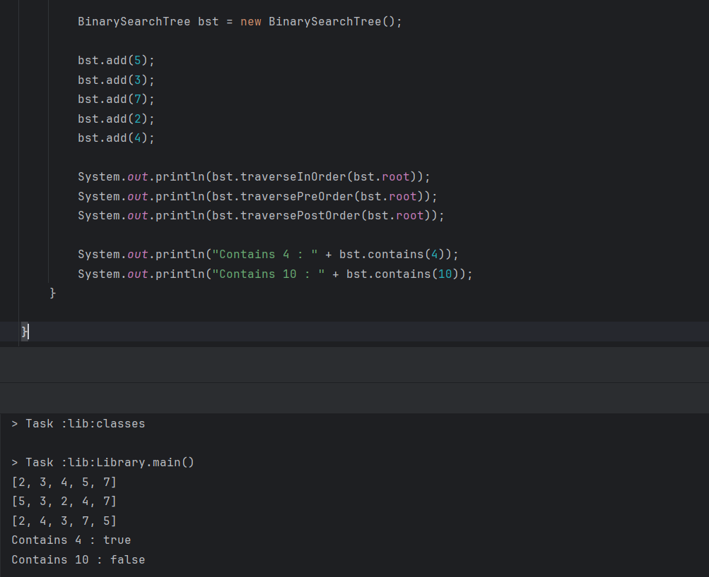

# Trees
### Trees are non-linear data structures. They are often used to represent hierarchical data. For a real-world example, a hierarchical company structure uses a tree to organize.

## Challenge
* Create a Node class that has properties for the value stored in the node, the left child node, and the right child node
* Implement a binary tree with three methods (traverseInOrder , traversePreOrder , traversePostOrder)
* Implement a binary search tree with two methods (add , contains)

## Whiteboard

## Approach & Efficiency
* Binary Tree
    * Time: The time complexity is O(n) because you will visit each node
    * Space: O(h) where h is the height of the tree (In the worst case) 
* Binary Search Tree
    * Time: insertion and search operations is O(h), or O(height), In a balanced (or “perfect”) tree, the height of the tree is log(n)
    * Space: O(h) for the recursive call stack

## Methods
* Binary Tree Methods:
    * preOrderTraverse: to print the data as root -> left -> right
    * inOrderTraverse: to print the data as left -> root -> right
    * postOrderTraverse: to print the data as left -> right -> root
* Binary Search Tree Methods:
    * add -> input integer: to add a new node to the tree and if the number was larger than the root go to the right and if smaller go to the left
    * contain -> input integer: search the tree if the value exists and return true if it does or false if it doesn't

## Solution

